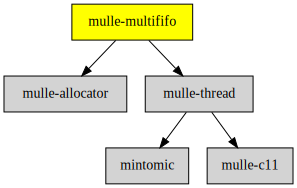

# mulle-multififo

#### 🐛 mulle-multififo multi-producer/multi-consumer FIFO holding `void *`

Written for multi-thread configurations. You can have multiple producers and
consumers operating on the FIFO. The size of the FIFO is set at runtime.
Use [mulle-fifo](//github.com/mulle-concurrent/mulle-fifo) if your require only
a dual-thread solution.

There is a locking and a non-locking variant.


| Release Version                                       | Release Notes
|-------------------------------------------------------|--------------
|  [](//github.com/mulle-concurrent/mulle-multififo/actions) | [RELEASENOTES](RELEASENOTES.md) |


## API

``` c
void   _mulle_pointermultififo_init( struct mulle_pointermultififo *p,
                                     unsigned int size,
                                     struct mulle_allocator *allocator)
```

Call `..._init` to initalize the FIFO for use. Specify a size for the FIFO.
A FIFO must be at least two entries sized. Tip: Make the FIFO _at_ _least_ as
big as the expected number of threads competing for access.


``` c
void   _mulle_pointermultififo_done( struct mulle_pointermultififo *p)
```

Call `..._done` to free the FIFO when no other thread needs it. This is
necessary to avoid leaks.


``` c
void   *_mulle_pointermultififo_read_barrier( struct mulle_pointermultififo *p)
```

Read from the FIFO. Will return NULL if empty, so will not block. Will put up
a memory barrier to ensure that the memory pointed to by the returned pointer
is valid.


``` c
int   _mulle_pointermultififo_write( struct mulle_pointermultififo *p,
                                     void *pointer)
```

Write to the FIFO. Will return -1 if full, 0 on success, so will not block.


## Usage

You can not store NULL pointers or `~0` pointers into the FIFO.

If the FIFO is full your write will return with an error. If the FIFO is empty
on read you will get a NULL pointer.


### You are here




## Add

**This project is a component of the [mulle-core](//github.com/mulle-core/mulle-core) library. As such you usually will *not* add or install it
individually, unless you specifically do not want to link against
`mulle-core`.**


### Add as an individual component

Use [mulle-sde](//github.com/mulle-sde) to add mulle-multififo to your project:

``` sh
mulle-sde add github:mulle-concurrent/mulle-multififo
```

To only add the sources of mulle-multififo with dependency
sources use [clib](https://github.com/clibs/clib):


``` sh
clib install --out src/mulle-concurrent mulle-concurrent/mulle-multififo
```

Add `-isystem src/mulle-concurrent` to your `CFLAGS` and compile all the sources that were downloaded with your project.


## Install

Use [mulle-sde](//github.com/mulle-sde) to build and install mulle-multififo and all dependencies:

``` sh
mulle-sde install --prefix /usr/local \
   https://github.com/mulle-concurrent/mulle-multififo/archive/latest.tar.gz
```

### Legacy Installation

Install the requirements:

| Requirements                                 | Description
|----------------------------------------------|-----------------------
| [mulle-thread](https://github.com/mulle-concurrent/mulle-thread)             | 🔠 Cross-platform thread/mutex/tss/atomic operations in C
| [mulle-allocator](https://github.com/mulle-c/mulle-allocator)             | 🔄 Flexible C memory allocation scheme

Download the latest [tar](https://github.com/mulle-concurrent/mulle-multififo/archive/refs/tags/latest.tar.gz) or [zip](https://github.com/mulle-concurrent/mulle-multififo/archive/refs/tags/latest.zip) archive and unpack it.

Install **mulle-multififo** into `/usr/local` with [cmake](https://cmake.org):

``` sh
cmake -B build \
      -DCMAKE_INSTALL_PREFIX=/usr/local \
      -DCMAKE_PREFIX_PATH=/usr/local \
      -DCMAKE_BUILD_TYPE=Release &&
cmake --build build --config Release &&
cmake --install build --config Release
```


## Author

[Nat!](https://mulle-kybernetik.com/weblog) for Mulle kybernetiK  


